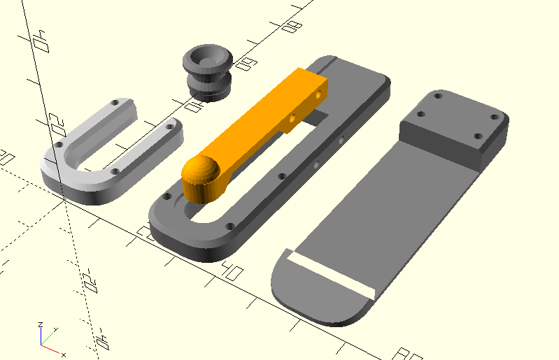

# Belt clip for lightsabers

This is the belt clip assembly compatible with my lightsaber models in OpenSCAD. This is designed to be used with lightweight 3D printed lightsabers, not heavier metal ones.

## Rendering STLs

Install *node.js* and *npm*. Generate all of the STLs for the project:

    npm run build

... or render STLs for individual parts by passing the names of each part:

    npm run build belt_clip_knob belt_clip_spring

## Printing

This can be printed on an FDM (filament) 3D printer without any supports. This will also likely be printable in resin. Print between 0.08mm and 0.20mm layer heights.

Print most of the pieces with the flat side down. Print the spring on its side. You may want to print the knob with more infill or thicker walls.

## Assembly

### Materials

* 2 x 20mm raw filament
* 8 x 10mm raw filament
* super glue

The pin holes may need to be cleaned up for the filament pins to fit. Put the belt clip spring in the slot on the belt clip body. The top surface of the spring should be flush with the slot on the body. Glue only the wide end of the spring and secure with the 2 20mm long pieces of filament. The thin section should be allowed to flex. Use 4 10mm pieces of filament to secure the face onto the body, and use the remaining 4 pieces of filament and glue on the hook onto the back of the body.

The knob gets attached to the lightsaber handle itself, not to the belt clip assembly.